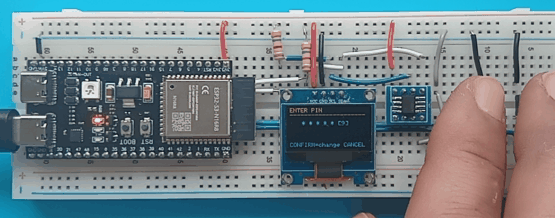
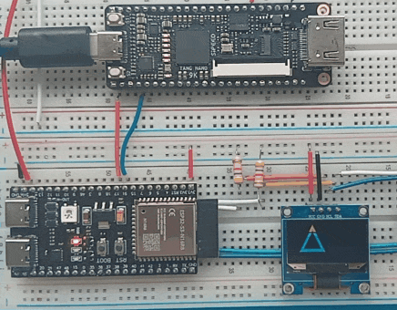

# TernaryCore PQC Reference Wallet Platform
### Powered by the CoinCube Open-Source Application Framework

This repository contains the experimental firmware, UI state machines, and hardware abstraction layers for the **TernaryCore post-quantum cryptographic reference architecture**. It is an evaluation sandbox that proves the TernaryCore FPGA matrix can be swapped into an established, functional Bitcoin wallet stack without touching any upstream application logic.

The UI and PSBT-signing application layer is built on the dual-tactile menu framework developed by **CoinCube** — all cryptographic operations are routed through a compile-time-selectable HAL that abstracts software emulators, legacy silicon, and the TernaryCore FPGA co-processor behind a single portable API.

---

> ## ⚠️ EXPERIMENTAL ARCHITECTURE — ACADEMIC & EVALUATION USE ONLY
>
> This repository contains experimental firmware, state machines, and hardware abstraction layers developed as an academic and engineering proof-of-concept for ternary-accelerated edge primitives. This software and its associated hardware schematics are intended solely for **laboratory evaluation, academic research, and cryptographic threat-modelling**.
>
> This architecture has **NOT** undergone formal regulatory verification, physical laboratory auditing, or security evaluation, including FIPS 140-2/140-3, Common Criteria (EAL), or ISO/IEC 19790. The physical boundaries, bus encryption mechanisms, and side-channel countermeasures implemented herein are transparent reference models and are not certified to withstand sophisticated invasive attacks (focused ion beam probing, advanced power analysis, localised laser glitching).
>
> **DO NOT use this software or any derived hardware to secure real-world cryptographic assets, mainnet private keys, or production digital capital.**
>
> THE COPYRIGHT HOLDERS AND CONTRIBUTORS PROVIDE THIS SOFTWARE AND HARDWARE BLUEPRINTS "AS IS" WITHOUT WARRANTY OF ANY KIND. IN NO EVENT SHALL THE AUTHORS, SHEPHERD SCIENTIFIC, OR ITS AFFILIATES BE LIABLE FOR ANY CLAIM, DAMAGES, OR OTHER LIABILITY — INCLUDING LOSS OF CRYPTOGRAPHIC TOKENS, PRIVATE KEYS, OR FINANCIAL ASSETS — ARISING FROM THE DEPLOYMENT OF THIS EXPERIMENTAL FABRIC.

---




## Hardware Architecture

The reference implementation targets an air-gapped topology that fully decouples user input and screen rendering from all network paths.

| Component | Part / Specification | System Role |
|:---|:---|:---|
| **Microcontroller** | ESP32-S3 (any standard module) | Application core, USB CDC stack, UI state machine, BIP32/39/44 parsing |
| **Display** | SSD1306 128×64 OLED | Transaction review, public address rendering, QR generation |
| **Input** | 2 × Tactile Buttons (N/O) | Navigation, confirmation / signing, transaction rejection |
| **Secure Element** | ATECC608B (current) / **TernaryCore FPGA** (target) | Key storage, ECDSA/PQC operations, TRNG, monotonic counter |

---

## Secure Element HAL Architecture

The platform implements a compile-time–selectable Secure Element HAL. Swapping co-processors requires only toggling a build flag — all wallet logic above the HAL is untouched.

```
┌─────────────────────────────────────────────────────────┐
│            Upstream Wallet Application Logic             │
└────────────────────────────┬────────────────────────────┘
                             │  Portable API (se051_hal.h)
                             ▼
┌─────────────────────────────────────────────────────────┐
│            Secure Element HAL Selection Layer            │
└──────────┬───────────────┬──────────────┬───────────────┘
           │               │              │
           ▼               ▼              ▼
   [ USE_SE_STUB ]  [ USE_ATECC608B ]  [ USE_TERNARYCORE_SE ]
   Pure Software     Legacy Silicon     Ternary PQC Matrix
   + NVS persist     I²C 0x64           UART GPIO16/17
```

| Flag | Backend | Status | Notes |
|---|---|---|---|
| `USE_SE_STUB` + `USE_NVS_PERSIST` | Software emulator, ESP32 NVS | ✅ **devsim target** | Full wallet UX with no SE hardware. Key material persists across reboots in the `secelem` NVS namespace. Factory Reset erases cleanly. |
| `USE_ATECC608B` | Microchip ATECC608B | ✅ In use | I²C `0x64`, ECDSA P-256, TRNG, monotonic counter, slot-based key store (slots must be provisioned before Config Zone lock) |
| `USE_TERNARYCORE_SE` | Tang Nano 9K FPGA custom SE | 🚧 Phase 2 | UART `Serial1` GPIO16/17 @ 115200 8N1, AT-command protocol (`AT+RAND`, `AT+SIGN`, `AT+PUBKEY`). Ternary-logic co-processor targeting lattice-based PQC (NTRU / CRYSTALS variants). Full `tc_cmd()` engine with host-mockable test harness (`test_ternarycore_se.cpp`). |
| `USE_SE051` | NXP SE051E | 🔜 Near-term | GlobalPlatform SCP03 secure channel, native Schnorr support, PQC extensions (CRYSTALS-Kyber, CRYSTALS-Dilithium) |

The TernaryCore FPGA target is the primary research horizon — a fully open, auditable, ternary-native cryptographic core verifiable to the gate level, unlike closed-source silicon SEs.

---

## Pin Assignments

```
ESP32-S3 Pin  │  Signal       │  Destination
──────────────┼───────────────┼──────────────────────────────────
GPIO 8        │  I²C SDA      │  SSD1306 SDA  +  ATECC608B SDA
GPIO 9        │  I²C SCL      │  SSD1306 SCL  +  ATECC608B SCL
GPIO 1        │  BTN_CONFIRM  │  Tactile button → GND
GPIO 2        │  BTN_CANCEL   │  Tactile button → GND
GPIO 16       │  UART TX      │  TernaryCore FPGA UART_RX (header pin 39)
GPIO 17       │  UART RX      │  TernaryCore FPGA UART_TX (header pin 38)
3V3           │  Power        │  SSD1306 VCC  +  ATECC608B VCC
GND           │  Ground       │  SSD1306 GND  +  ATECC608B GND  +  Buttons
USB D+/D−     │  Native USB   │  USB-C (PSBT exchange / firmware flash)
```

---

## Wiring Diagram

```
                    ┌─────────────────────────────────────┐
                    │            ESP32-S3                 │
                    │                                     │
  ┌──────────────┐  │ 3V3 ──────────────────────────────  │
  │ SSD1306 OLED │  │ GND ──────────────────────────────  │
  │  128×64 px   │  │                                     │
  │  I²C 0x3C    │  │ GPIO8 (SDA) ───────────────────────►│
  │              │  │ GPIO9 (SCL) ───────────────────────►│
  │ VCC ◄────────┼──┤ 3V3                                 │
  │ GND ◄────────┼──┤ GND                     GPIO1 ◄─────┼── [CONFIRM]─── GND
  │ SDA ◄────────┼──┤ GPIO8 (SDA) ──┐         GPIO2 ◄─────┼── [CANCEL] ─── GND
  │ SCL ◄────────┼──┤ GPIO9 (SCL) ──┤                     │
  └──────────────┘  │               │ shared I²C bus       │
                    │               │                     │
  ┌──────────────┐  │               │                     │
  │ ATECC608B    │  │               │            USB D+/D─ ◄─── USB-C
  │  Secure Elem │  │               │                     │
  │  I²C 0x64    │  │               │                     │
  │ VCC ◄────────┼──┤ 3V3           │                     │
  │ GND ◄────────┼──┤ GND           │                     │
  │ SDA ◄────────┼──┘ (shared) ─────┘                     │
  │ SCL ◄────────┼── GPIO9 (shared)                       │
  └──────────────┘  └─────────────────────────────────────┘

  [CONFIRM] = tactile button, normally open, pin A → GPIO1, pin B → GND
  [CANCEL]  = tactile button, normally open, pin A → GPIO2, pin B → GND
  Both buttons use ESP32-S3 internal pull-ups (INPUT_PULLUP). No external resistors needed.
  Both I²C devices share the same SDA/SCL lines. Pull-ups: 4.7 kΩ to 3V3 recommended.
```

### TernaryCore FPGA SE Wiring

Build with `pio run -e ternarycore` to use the Tang Nano 9K FPGA as the UART-based secure element instead of the ATECC608B. The FPGA connects via a dedicated UART and does not share the I²C bus.

```
ESP32-S3 GPIO16 (TX)  →  Tang Nano 9K header pin 39 (UART_RX)
ESP32-S3 GPIO17 (RX)  ←  Tang Nano 9K header pin 38 (UART_TX)
ESP32-S3 GND          ——  Tang Nano 9K GND
```

---

## Build Targets

```bash
# Development — WiFi OTA enabled, ATECC608B I²C SE
pio run -e dev -t upload

# devsim — No SE hardware required. Full wallet UX via software stub + NVS.
# Use this for UI development and demo when no provisioned ATECC is available.
pio run -e devsim -t upload

# Production — WiFi fully disabled, ATECC608B, no OTA
pio run -e production -t upload

# TernaryCore FPGA SE — UART GPIO16/17, AT-command protocol
pio run -e ternarycore -t upload

# NXP SE051 — I²C 0x48 (chip not currently available)
pio run -e nxpse -t upload

# Monitor serial output (all targets)
pio device monitor -b 115200
```

### devsim — SE Bypass for UI Development

When no provisioned ATECC608B is available (or the Config Zone is already locked against additional slot writes), build with `devsim`. This replaces the SE with a pure-software stub backed by ESP32 NVS:

- All `se051_*` HAL calls resolve to RAM + NVS operations — no I²C activity at all.
- Key material (`secelem` NVS namespace) survives reboots identically to a real SE.
- `Settings → Factory Reset` calls `se051_delete_key()` for all object IDs, cleanly erasing NVS entries.
- `SKIP_INTEGRITY_CHECK` disables the firmware hash gate so the boot loop completes without a provisioned hash slot.

```bash
pio run -e devsim -t upload
```

### Build Target Comparison

| Aspect | `dev` | `devsim` | `production` |
|---|---|---|---|
| SE backend | ATECC608B (I²C) | Software stub (NVS) | ATECC608B (I²C) |
| WiFi / OTA | Enabled | Enabled | **Disabled** |
| Integrity check | Skipped | Skipped | **Enforced** |
| SE required | Yes | **No** | Yes |
| Binary size | ~1.5 MB | ~1.5 MB | < 1.2 MB |

---

## Component Notes

### SSD1306 OLED (128×64)
I²C address `0x3C`. At `textSize(1)`, each character is 6×8 px — 21 characters across, 8 rows. The display auto-offs after a configurable timeout (default 60 s) to prevent burn-in and reduce the side-channel attack surface. A screensaver (bouncing TernaryCore triangle logo) activates at 30 s idle.

### Microchip ATECC608B Secure Element
I²C address `0x64`. All of the following happen inside the SE and never leave it:

- Master private key storage (slot-mapped BIP32 key material)
- ECDSA signatures (P2WPKH inputs, BIP143 sighash)
- True random number generation (seed entropy and anti-phishing code)
- Monotonic PIN attempt counter (tamper-resistant, cannot be reset by reflash)
- PIN hash storage and firmware integrity hash (slot 0x0C)

The ESP32-S3 only ever sees public keys and signatures. The HAL (`atecc608_hal_esp.cpp`) implements the Microchip CryptoAuthLib-compatible wire protocol including the LSB-first CRC-16/8005 variant and chip wake sequence.

> **Config Zone lock caveat:** Once the ATECC Config Zone is locked at the factory, only provisioned slots accept writes. Slots that were not configured before the lock will reject WRITE commands with ExecError. Use the `devsim` target for development on unprovisioned devices.

### Buttons (GPIO1 / GPIO2)
Normally-open tactile switches wired from GPIO to GND. Internal pull-ups enabled via `INPUT_PULLUP` — no external resistors needed. A 180 ms software debounce delay is applied after each detected edge.

| Screen | CONFIRM (GPIO1) | CANCEL (GPIO2) |
|---|---|---|
| Main menu | Enter selected item | Cycle to next item |
| Submenus / info | Return to menu | Return to menu |
| Sign TX | Sign and return PSBT | Reject and return to menu |
| PIN entry | Select current digit | Advance to next digit |
| Mnemonic display | Confirm word / done | Advance to next word |

### Native USB (ESP32-S3)
Built-in USB 1.1 full-speed PHY. Dev builds support WiFi OTA. **Production builds disable WiFi entirely** (`-DPRODUCTION_BUILD`) — the radio is powered off at boot and the USB port exposes CDC serial only. PSBT exchange protocol is newline-delimited base64:

```
Host   →  Device :  PSBT:<base64>\n
Device →  Host   :  SIGNED:<base64>\n  |  REJECTED\n  |  ERROR:<code>\n
```

---

## I²C Bus Notes

The SSD1306 and ATECC608B share the same I²C bus (SDA=GPIO8, SCL=GPIO9) at different addresses (`0x3C` vs `0x64`). The ESP32-S3 is the sole bus master.

- Pull-ups: **4.7 kΩ to 3V3** on SDA and SCL. Many SSD1306 breakout boards include these; ATECC608B modules typically do not.
- Clock: **400 kHz Fast Mode** recommended (ATECC608B supports up to 1 MHz; SSD1306 typically rated to 400 kHz).
- Wire timeout: **50 ms** per transaction in the SE HAL. If the ATECC does not ACK the wake token the HAL returns `SE_ERR_COMM` and the wallet boots without SE.

---

## Power

Runs from USB 5V regulated to 3V3 by the ESP32-S3 module's onboard LDO.

| State | Current |
|---|---|
| Idle (OLED on, SE idle) | ~40 mA |
| During signing (SE active) | ~60 mA |
| OLED off (display timeout) | ~15 mA |

A **100 nF decoupling capacitor** close to the SE VCC pin is strongly recommended to suppress I²C transaction noise.

---

## Firmware Version Attestation

The `Settings → About` screen aggregates identity state at boot:

- **CORE**: TernaryCore PQC (this platform)
- **BASE**: CoinCube Stack (application framework)
- **FW**: version string from `FIRMWARE_VERSION` in `version.h`
- **HASH**: first 16 hex chars of the firmware binary SHA-256 (injected post-build by `scripts/post_build.py`)
- **TYPE**: ACADEMIC EVAL

Users can verify the firmware hash against published build artifacts to confirm authentic software.

> **Known post-build limitation:** `post_build.py` patches the binary after the ESP-IDF bootloader computes the app-image digest. This invalidates the digest and triggers `rst:0x3` if Secure Boot is active. The script is therefore disabled for dev/devsim environments. Before re-enabling it for production, `post_build.py` must recompute and re-seal the image digest via `esptool.py` after patching — or the build hash should be stored as a compile-time `-D` flag instead.

---

## Secure Boot v2 & Flash Encryption (Production)

ESP32-S3 Secure Boot v2 ensures only signed firmware executes. Combined with flash encryption it protects against flash chip extraction, unauthorised firmware replacement, and rollback attacks.

**Both features are PERMANENT once eFuses are burned. Test thoroughly first.**

### Key Ceremony

```bash
# Generate secure boot signing key (offline, air-gapped machine)
openssl ecparam -name prime256v1 -genkey -noout -out secure_boot_signing_key.pem

# Extract public key
openssl ec -in secure_boot_signing_key.pem -pubout -out secure_boot_signing_key.pub

# Generate flash encryption key (256-bit AES / XTS-AES-256)
openssl rand -out flash_encryption_key.bin 32
# Store keys in HSM or air-gapped encrypted storage — NEVER commit to the repo
```

### eFuse Burning (Manufacturing)

```bash
# Flash and test WITHOUT eFuses first
pio run -e production -t upload
pio device monitor -b 115200
# Verify: boot splash, PIN entry, About screen, sign a transaction

# Only after successful testing:
pip install esptool

espefuse.py --port /dev/cu.usbmodem* burn_key BLOCK_KEY0 secure_boot_signing_key.pem SECURE_BOOT
espefuse.py --port /dev/cu.usbmodem* burn_efuse SECURE_BOOT_EN 1
espefuse.py --port /dev/cu.usbmodem* burn_key BLOCK_KEY1 flash_encryption_key.bin FLASH_CRYPT
espefuse.py --port /dev/cu.usbmodem* burn_efuse FLASH_CRYPT_CNT 127
espefuse.py --port /dev/cu.usbmodem* summary
```

After burning, the device will reject unsigned firmware, encrypt all flash partitions on first boot, and store NVS encrypted at rest.

---

## Repository Structure

```
wallet1.ino             — Main firmware: state machine, display render, navigation
atecc608_hal_esp.cpp    — ATECC608B HAL (USE_ATECC608B)
se051_hal_esp.cpp       — NXP SE051 HAL (USE_SE051)
se051_hal_stub.cpp      — Software SE stub + optional NVS persistence (USE_SE_STUB)
ternarycore_se_hal.cpp  — TernaryCore FPGA UART HAL (USE_TERNARYCORE_SE)
se051_hal.h             — Portable HAL interface (shared by all backends)
bip32/bip39/…           — BIP standards: key derivation, mnemonic, address encoding
pin_manager.cpp         — PIN HMAC, attempt counter, factory reset
wallet_storage.cpp      — Seed encryption, PBKDF2 key stretching
screensaver.cpp/h       — Bouncing logo screensaver (30 s idle timeout)
scripts/post_build.py   — Post-build binary hash injection
scripts/provision_fw_hash.py — Factory firmware hash provisioning (ATECC slot 0x0C)
platformio.ini          — Build environments: dev, devsim, production, ternarycore, nxpse
DISCLAIMER.md           — Full liability waiver
```
